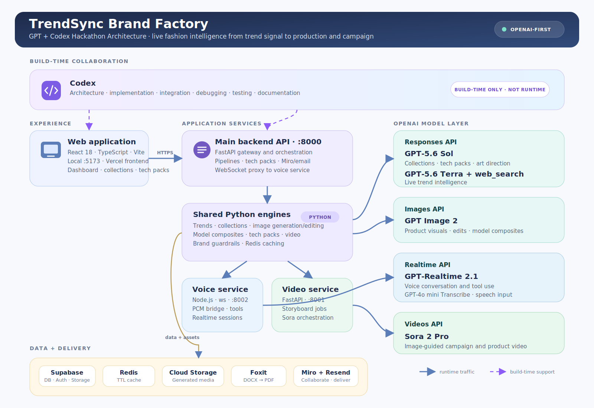
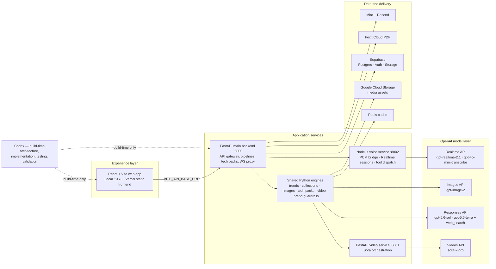

# TrendSync Brand Factory

TrendSync Brand Factory is a live, end-to-end fashion-design workspace built for the **GPT and Codex Hackathon**. It turns real-time market signals into a brand-compliant collection, product visuals, manufacturing-ready tech packs, and campaign content from one connected dashboard.

The goal is simple: help small and mid-sized fashion teams move from insight to execution faster, without losing their brand point of view.

## Why it matters

Fashion teams regularly lose time moving between trend research, mood boards, creative briefs, image tools, technical specifications, and campaign production. TrendSync connects those steps so that a decision made during trend research informs every downstream artifact.

- **Faster creative cycles:** explore, refine, validate, and document a collection in one workflow.
- **Brand consistency:** persistent brand rules guide colors, materials, visual direction, and compliance checks.
- **Production readiness:** save a reviewed tech pack once, then generate the PDF from that source of truth.
- **Accessible AI leverage:** give lean fashion teams capabilities that usually require a much larger creative-operations stack.

## GPT + Codex hackathon story

TrendSync is intentionally OpenAI-first. The product uses specialized OpenAI models for the job each one does best, while **Codex** accelerated the build itself: architecture work, implementation, integration, debugging, verification, documentation, and the current pitch asset.

Codex is a build-time collaborator, not a runtime dependency. The app’s production experience is powered by the services and models below.

| Capability | OpenAI model or service | Env override | Role |
|---|---|---|---|
| Collection planning, tech packs, art direction, storyboards, Lux design companion | `gpt-5.6-sol` (fallback `gpt-5.6-terra`) | `OPENAI_MODEL` | Deep reasoning and structured fashion-design work |
| Trend intelligence | `gpt-5.6-terra` + hosted `web_search` | `OPENAI_TREND_MODEL` | Fast, web-grounded trend synthesis with low reasoning effort |
| Product generation, edits, and model composites | `gpt-image-2` | `OPENAI_IMAGE_MODEL` | Brand-aware visual generation and multi-image editing |
| Live voice companion | `gpt-realtime-2.1` (fallback `gpt-realtime-2`) | `OPENAI_VOICE_MODEL` | Low-latency speech-to-speech conversation and tool use |
| Voice transcription | `gpt-4o-mini-transcribe` | — | English speech transcription for the live voice experience |
| Campaign and product video | `sora-2-pro` | `OPENAI_VIDEO_MODEL` | Image-guided cinematic video generation |
| Hackathon pitch narration | `gpt-4o-mini-tts` | — | AI-generated voiceover asset |

> The Supabase `generate-product-image` edge function retains Bria FIBO. All other first-party AI workflows use OpenAI.

## What the app does

- **Trend intelligence:** uses OpenAI hosted web search to identify live fashion signals across colors, silhouettes, materials, themes, and celebrity influence.
- **Collection generation:** turns trend and brand inputs into structured product concepts and detailed image direction.
- **GPT Image workflows:** creates product imagery, performs natural-language edits, and composites garments onto company models.
- **Brand Guardian:** applies deterministic brand-compliance checks across color, camera, lighting, and negative-prompt rules.
- **Lux design companion:** a tool-using OpenAI Agents SDK assistant for image analysis, edits, trends, compliance, variations, and design saving.
- **Live voice companion:** lets a designer speak naturally to Lux while the same backend tools remain available in real time.
- **Tech packs and lookbooks:** generates specifications, saves approved data to Supabase, and uses Foxit to deliver professional PDF documents.
- **Campaign video:** creates storyboarded video content using OpenAI Sora.
- **Miro and email delivery:** sends production artifacts to collaborative Miro boards and supports email-based handoff.

## Architecture





The same diagram is generated for the Miro board by [`scripts/redraw_miro_architecture.py`](scripts/redraw_miro_architecture.py).

## Data flow

```text
Trend request
  → OpenAI web search + GPT-5.6 Terra
  → collection plan + GPT-5.6 Sol
  → GPT Image 2 product visuals and edits
  → brand validation and approved tech-pack data in Supabase
  → Foxit PDF or Sora campaign video
```

The crucial consistency rule is: **save the tech pack once, then generate the PDF from saved data only.** This prevents the designer-approved UI from drifting from the document sent to manufacturing.

## Repository layout

```text
src/                                  React + TypeScript frontend
trendsync-backend/
  services/main-backend/              FastAPI API gateway
  services/video-gen-service/         Sora video microservice
  services/voice-companion/           Node.js Realtime voice service
  shared/                             Reusable AI engines and integrations
supabase/functions/                   Supabase Edge Functions
scripts/redraw_miro_architecture.py   Generates the Miro architecture diagram
public/trendsync-brand-factory-*      Hackathon voiceover MP3 and script
```

## Local development

### Frontend

```bash
npm install
npm run dev
npm run build
npm run lint
```

The Vite frontend runs at `http://localhost:5173`.

### Backend services

Install dependencies from `trendsync-backend/`, then start each service in its own terminal:

```bash
cd trendsync-backend && pip install -r requirements.txt

# Main API gateway
uvicorn services.main-backend.main:app --host 0.0.0.0 --port 8000 --reload

# Video generation
uvicorn services.video-gen-service.main:app --host 0.0.0.0 --port 8001 --reload

# Voice companion
cd services/voice-companion && npm install && npm run dev
```

### Required environment variables

Keep secrets in `.env` or your hosting provider’s secret store—never in browser code or Git.

| Variable | Used by |
|---|---|
| `OPENAI_API_KEY` | Backend AI services only |
| `OPENAI_MODEL` | Defaults to `gpt-5.6-sol` |
| `OPENAI_TREND_MODEL` | Defaults to `gpt-5.6-terra` |
| `OPENAI_VOICE_MODEL` | Defaults to `gpt-realtime-2.1` |
| `OPENAI_IMAGE_MODEL` | Defaults to `gpt-image-2` |
| `OPENAI_VIDEO_MODEL` | Defaults to `sora-2-pro` |
| `VITE_SUPABASE_URL`, `VITE_SUPABASE_ANON_KEY` | Browser Supabase configuration |
| `VITE_API_BASE_URL` | Hosted FastAPI gateway URL for the production frontend |
| `VOICE_COMPANION_URL` | Main backend to voice-service WebSocket URL |
| `MIRO_ACCESS_TOKEN`, `MIRO_BOARD_ID` | Miro architecture/tech-pack integrations |
| Foxit, Supabase, Redis, GCS, and Resend variables | Relevant integration services |

## Deployment note

Vercel can host the static Vite frontend. The FastAPI gateway, video service, and persistent Node.js WebSocket voice service need a separate service or container host. Before a public deployment can use AI features, deploy those services and set `VITE_API_BASE_URL` to the reachable main-backend URL.

## Hackathon pitch asset

- [Voiceover MP3](public/trendsync-brand-factory-voiceover.mp3)
- [Voiceover script](public/trendsync-brand-factory-voiceover-script.txt)

The voiceover is AI-generated and should be labelled accordingly whenever it is played publicly.
